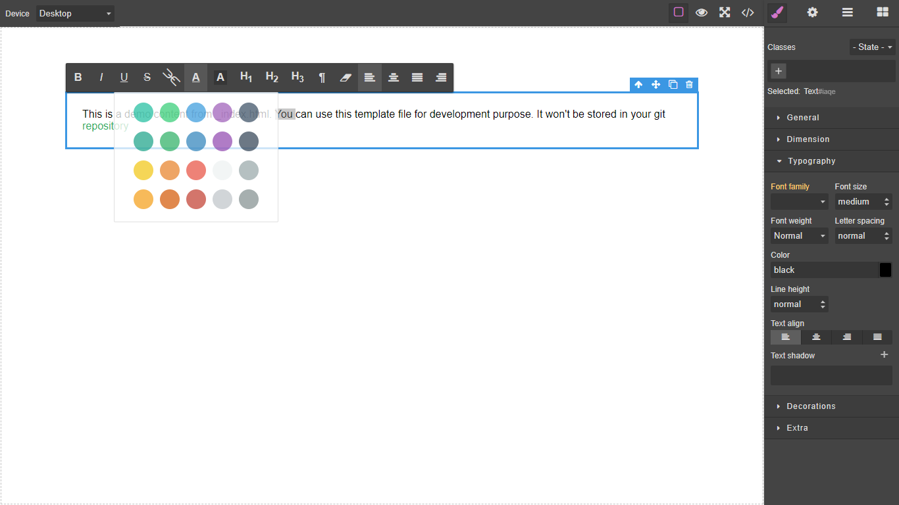

# Grapesjs Rte Extensions

Some useful actions supported by the `grapesjs` built-in rich text editor but not implemented by default

<p align="center">
  
</p>

### HTML
```html
<link href="https://unpkg.com/grapesjs/dist/css/grapes.min.css" rel="stylesheet">
<script src="https://unpkg.com/grapesjs"></script>
<link href="https://unpkg.com/grapesjs-rte-extensions/dist/grapesjs-rte-extensions.min.css" rel="stylesheet">
<script src="https://unpkg.com/grapesjs-rte-extensions"></script>

<div id="gjs"></div>
```

### JS
```js
const editor = grapesjs.init({
	container: '#gjs',
  height: '100%',
  fromElement: true,
  storageManager: false,
  plugins: ['grapesjs-rte-extensions'],
});
```

### CSS
```css
body, html {
  margin: 0;
  height: 100%;
}
```


## Summary

* Plugin name: `grapesjs-rte-extensions`


## Options

Set section to `false` to disable completely

| Option | Description | Default |
|-|-|-
| `base` | This is section contains default `rte` buttons | `base: {bold: true,italic: true,underline: true,strikethrough: true,link: true,},` |
| `fonts` | Buttons for font options | `fonts: {fontColor: true,hilite: true,},` |
| `format` | Buttons for format options | `format: heading1: true,heading2: true,heading3: true,paragraph: true,clearFormatting: true,},` |
| `indentOutdent` | Indent and outdent buttons | `false` |
| `list` | Ordered and unordered list buttons | `false` |
| `align` | Text align buttons | `false` |
| `actions` | Copy, cut, paste and delete buttons | `false` |
| `extra` | Code and horizontal line buttons | `false` |
| `undoredo` | undo and redo buttons | `false` |
| `order` | `NB not yet implemented.` Order of the above sections after `base` section, use "/" for `newline`, for now you can't rearrange the buttons inside the sections | `['format', 'subscriptSuperscript', 'indentOutdent', 'list', 'align', 'actions', 'undoredo', 'extra']` |


## Download

* CDN
  * `https://unpkg.com/grapesjs-rte-extensions`
* NPM
  * `npm i grapesjs-rte-extensions`
* GIT
  * `git clone https://github.com/Ju99ernaut/grapesjs-rte-extensions.git`


## Usage

Directly in the browser
```html
<link href="https://unpkg.com/grapesjs/dist/css/grapes.min.css" rel="stylesheet"/>
<script src="https://unpkg.com/grapesjs"></script>
<link src="path/to/grapesjs-rte-extensions.min.css" rel="stylesheet"/>
<script src="path/to/grapesjs-rte-extensions.min.js"></script>

<div id="gjs"></div>

<script type="text/javascript">
  var editor = grapesjs.init({
      container: '#gjs',
      // ...
      plugins: ['grapesjs-rte-extensions'],
      pluginsOpts: {
        'grapesjs-rte-extensions': {
          // default options
          base: {
            bold: true,
            italic: true,
            underline: true,
            strikethrough: true,
            link: true,
          },
          //fonts: {
          //  fontName: ['font1',...,'fontn'],
          //  fontSize: true,
          //  //An array of strings representing colors
          //  fontColor: ['#fff',...],
          //  //An array of strings representing colors
          //  hilite: ['#fff',...],
          //}
          fonts: {
            fontColor: true,
            hilite: true,
          },
          format: {
            heading1: true,
            heading2: true,
            heading3: true,
            //heading4: false,
            //heading5: false,
            //heading6: false,
            paragraph: true,
            //quote: false,
            clearFormatting: true,
          },
          subscriptSuperscript: false,//|true
          indentOutdent: false,//|true
          list: false,//|true
          align: true,//|true
          //actions: {
          //  copy: true,
          //  cut: true,
          //  paste: true,
          //  delete: true,
          //},
          actions: false,//|true
          undoredo: false,//|true
          extra: false,//|true
          //"/" to insert line break
          order: ['format', 'subscriptSuperscript', 'indentOutdent', 'list', 'align', 'actions', 'undoredo', 'extra'],
        }
      }
  });
</script>
```

Modern javascript
```js
import grapesjs from 'grapesjs';
import plugin from 'grapesjs-rte-extensions';
import 'grapesjs/dist/css/grapes.min.css';
import 'grapesjs-rte-extensions/dist/grapesjs-rte-extensions.min.css';

const editor = grapesjs.init({
  container : '#gjs',
  // ...
  plugins: [plugin],
  pluginsOpts: {
    [plugin]: { /* options */ }
  }
  // or
  plugins: [
    editor => plugin(editor, { /* options */ }),
  ],
});
```


## Development

Clone the repository

```sh
$ git clone https://github.com/Ju99ernaut/grapesjs-rte-extensions.git
$ cd grapesjs-rte-extensions
```

Install dependencies

```sh
$ npm i
```

Start the dev server

```sh
$ npm start
```

Build the source

```sh
$ npm run build
```


## License

MIT
